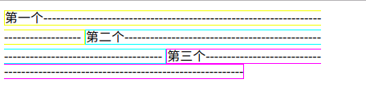
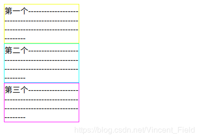

# CSS属性display的inline、block、inline-block的区别

## 三种元素解释

block:：对象为块状元素，整体保持块状状态（矩形形状），并且单独占据一行（同一行内不会有兄弟节点）

inline：对象为行内元素，整体不会一定保持块状状态，并且不会一定单独占据一行，超过一行的部分进入下一行

inline-block：介于block与inline之间，整体保持块状状态，但不会一定单独占据一行

## 案例解析

### HTML

```
<!DOCTYPE html>
<html>
<head>
<title>test</title>
<style>
.dsp-demo {
    width: 150px;
    display: inline;
/*    display: block; */
/*    display: inline-block; */
}
</style>
</head>
<body>
<div style="width: 400px;">
<span class="dsp-demo" style="border: 1px solid #ff0;">
第一个-----------------------------------------------------------------------------------
</span>
<span class="dsp-demo" style="border: 1px solid #0ff;">
第二个-----------------------------------------------------------------------------------
</span>
<span class="dsp-demo" style="border: 1px solid #f0f;">
第三个-----------------------------------------------------------------------------------
</span>
</div>
</body>
</html>

```


### inline元素呈现效果


### block元素呈现效果


### inline-block元素呈现效果


### 解析

如上所示：inline元素的呈现中，注意第一个span的第二行与第一行宽度不相同，并且span的边界跨越了多行（无块状特性），该特性导致设置的width、height属性无效，第二个span接续第一个span继续呈现（不独占一行特性）；block元素的呈现中，span整体为矩形（块状特性），虽然父div有400px的宽度，span仅需150px，理论上一行可存在二个span，但第二个span仍然另起一行显示（独占一行特性）；inline-block元素的呈现中，span整体为矩形（块状特性），一行显示两个span（不独占一行特性）

