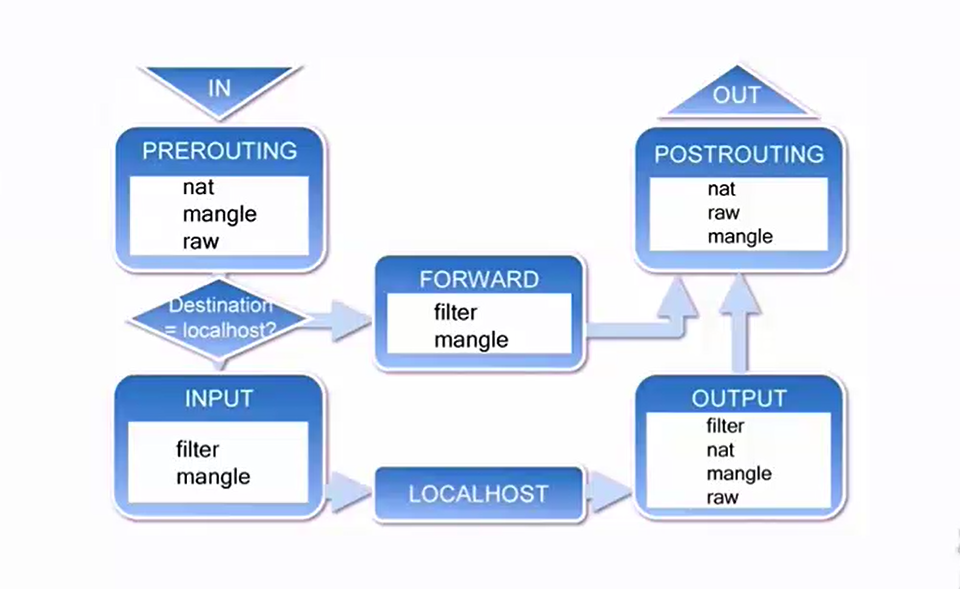

# iptables 笔记
## 结构

## 命令
显示列表：iptables -t filter -L -n      -t参数指定显示哪个链，默认filter链  
清空设置：iptables -F  
阻止特定源ip（111.111.11.11）对目的ip（10.18.139.82）的8080端口访问：iptables -I DOCKER -s 111.111.11.11 -d 10.18.139.82 -p TCP --dport 8080 -j DROP  
