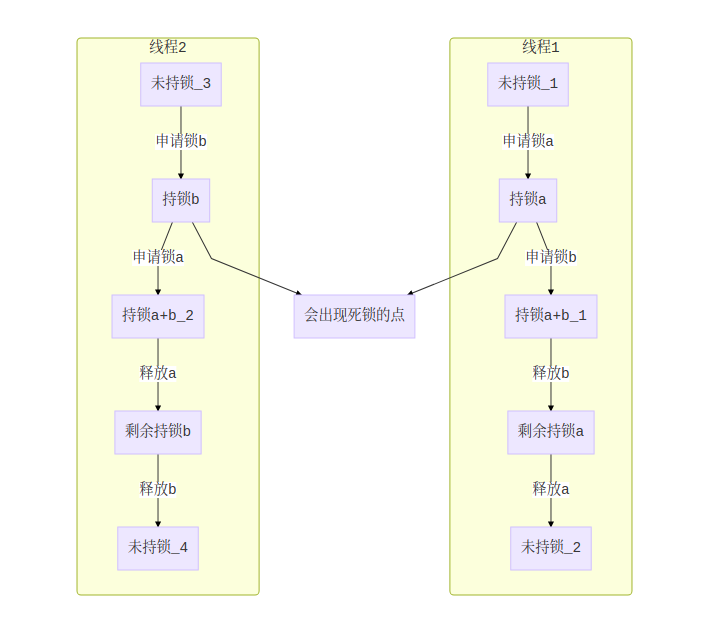
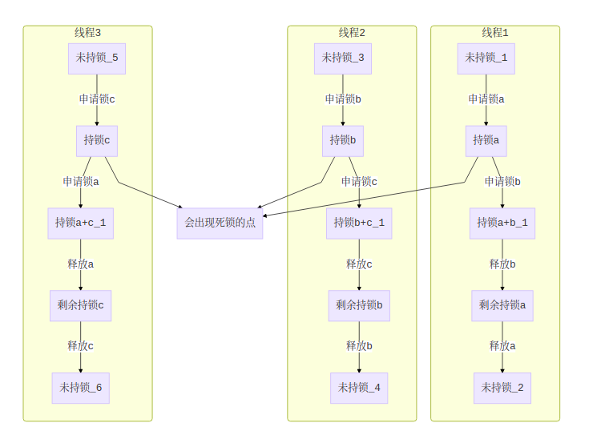

# 多线程加锁原则
1. 单条线程只同时持有一个锁的情况下，无论多少条线程肯定不会造成死锁
2. 同时持有多个锁的代码，只要不出现持锁顺序（考虑传递性）相反的情况，无论多少条线程肯定不会出现死锁
# 死锁分析
## 非传递性持锁顺序相反的死锁案例

线程1持有锁a等待锁b，线程2持有锁b等待锁a。这种情况下的分析，线程1上锁的顺序是ab，线程2上锁的顺序是ba，持锁顺序相反，代码运行到特定的点会导致死锁的情况出现
## 传递性下的持锁顺序相反的死锁案例

线程1持有锁a等待锁b，线程2持有锁b等待锁c，线程3持有锁c等待锁a。这种情况，就是传递性情况下持锁顺序相反导致的死锁（就是我们通常说的构成了闭环）。线程1上锁的顺序是ab，线程2上锁的顺序是bc，线程3持锁的顺序为ca。这种情况下的分析，考虑作并线处理分析。将线程1与线程2并线分析，则他们并线后持锁顺序是abc，而线程3的持锁顺序是ca，这里面两边ac锁的顺序相反，代码运行到特定的点会导致死锁的情况出现
