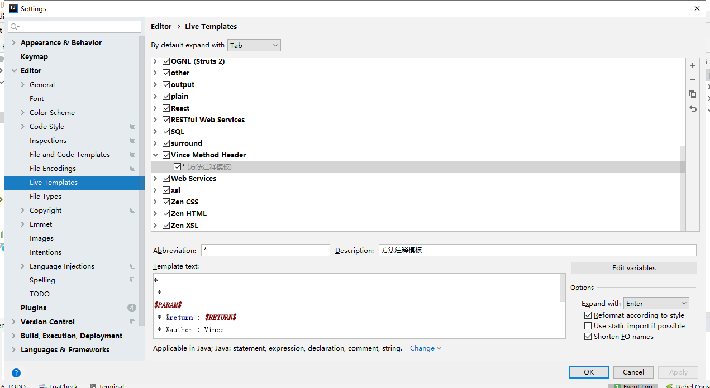
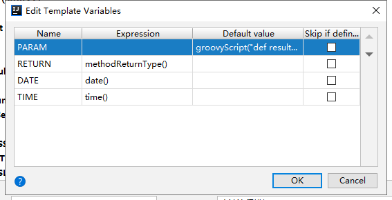

# IDEA习惯偏好设置 

## 快捷键偏好设置

1. 查找(Keymap -> Main Menu -> Edit -> Find -> Find...) ：Ctrl + F    【速记：find】 
2. 复制上一行到下一行(Keymap -> Edit Actions -> Duplicate Entire Lines) ： Ctrl + 向下箭头 
3. 移动代码到上一行(Keymap -> Main Menu -> Code -> Move Statement Up) ： Alt + 向上箭头 
4. 移动代码到下一行(Keymap -> Main Menu -> Code -> Move Statement Down) ： Alt + 向下箭头 
5. 删除一行(Keymap -> Editor Actions -> Delete Line) ： Ctrl + D    【速记：delete】 
6. 调出代码提示(Keymap -> Main Menu -> Code -> Completion -> Basic) ： Alt + / 
7. 自动补全返回变量(Keymap -> Main Menu -> Refactor -> Extract -> Variable...) ： Alt + Enter 
8. 显示代码在哪里被使用(Keymap -> Main Menu -> Edit -> Find -> Find Usages) ： Ctrl + U     【速记：Usage】 
9. 代码格式化(Keymap -> Main Menu -> Code -> Reformat Code) ：Ctrl + Shift + F    【速记：format】 
10. 重命名(Keymap -> Main Menu -> Refactor -> Rename...) ： Alt + Shift + R    【速记：refact】 
11. 全局查找(Keymap -> Main Menu -> Edit -> Find -> Find in Path...)：Ctrl + P    【速记：path】 
12. 返回或前进到上次光标所在处(Keymap -> Main Menu -> Navigate -> Back / Forward)：Alt + 向左箭头/向右箭头
13. 显示层级关系(Keymap -> Main Menu -> Navigate -> Type Hierarchy)：Ctrl + H    【速记：hierarchy】 
14. 定位到继承代码(Keymap -> Main Menu -> Navigate -> Implementation(s))：Ctrl + Alt + Button1 Click
15. 定位到声明代码(Keymap -> Main Menu -> Navigate -> Declaration)：Ctrl + Button1 Click
16. 删除Java文件不用的依赖(Keymap -> Main Menu -> Code -> Optimize Imports)：Ctrl + Shift + O
17. 显示参数列表(Keymap  -> Main Menu -> View -> Parameter Info)：Alt + P    【速记：parameter】 

18. 取消双击shift更改为其他键(双击shift -> Actions)：输入registry... >> 其后选择点击`registry...`项 >> 找到`ide.suppress.double.click.handler`键名，右边打勾禁止双击shift处理 >> close >> 设置新快捷键(File => Settings... -> Keymap -> Other -> Search Everywhere不是文件夹项)：Ctrl + W    【速记：watch或where】 

CTRL为基础组合键，与ALT相关的组合键通常是代码修改的辅助有关

## 其他偏好设置

1. 鼠标悬浮方法显示文档(Editor -> General => Show quick documentation on mouse move) ：打勾 

2. 自动为Java文件添加明确的导入依赖(Editor -> General -> Auto Import => Add unambiguous imports on the fly)：打勾

3. 自动补全中显示字段名称提示(Editor -> General -> Code Completion => Parameter => Show parameter name hints on completion)：打勾

4. 方法常量变量显示参数名称提示(Editor -> General -> Appearance => Show parameter name hints)：打勾 >> 点开右边Configure配置页面，Language选Java，Do not开头的取消打勾，Show开头的打勾

5. 显示链式调用方法的参数提示(Editor -> General -> Appearance => Show chain call type hints)：打勾

6. 自动提示中显示文档（与参数列表择一足矣）(Editor-> General -> Code Completion => Show the Documentation popup in 1000 ms)：打勾

7. 代码字体大小调大到14(Editor -> Font -> Size)

8. Idea插件：CodeGlance（缩略图）、Rainbow Brackets（彩色括号）

9. 新项目默认编码设置(File => Other Settings => Settings for New Projects... -> Editor -> File Encodings => Global Encoding和Project Encoding)：UTF-8        [已创建的项目，在File => Project Structure...设置]

10. 新项目默认JDK设置(File => Other Settings => Structure for New Projects... -> Project Settings -> Platform Settings)：点击加号添加jdk，其后 >>  设置版本(Project Settings -> Project => Project SDK)：选择环境及默认版本级别        [已创建的项目，在File => Project Structure...设置]

11. 行代码显示最后提交信息[Other Settings -> Git ToolBox Global => General -> Show editor inline 'Blame']：打勾

12. 方法之间显示分割线[Editor -> General -> Appearance => Show method separator]：打勾

13. 文件头注释模板：File Header(Editor -> File and Code Templates -> Includes -> File Header)

    ```
    /**
     *
     * @Author: Vince
     * @Date: ${DATE} ${TIME}
     */
    ```

14. 通过特殊字符触发的方法注释模板(Editor -> Live Templates)：右边加号新加一个Template Group与Live Template

   

   Abbreviation框填入`*`，Expand with选择回车，TemplateText填入生成的字符串

   ```
   *
    * 
   $PARAM$
    * @return : $RETURN$
    * @author : Vince
    * @date : $DATE$ $TIME$
    */
   ```

   字符串中包含`$PARAM$`、`$RETURN$`、`$DATE$`、`$TIME$`等变量，点击`Edit variables`编辑变量如下

   

   其中PARAM使用groovy脚本添加参数

   ```
   groovyScript("def result=''; def params=\"${_1}\".replaceAll('[\\\\[|\\\\]|\\\\s]', '').split(',').toList(); for(i = 0; i < params.size(); i++) {result+=' * @param ' + params[i] + ((i < params.size() - 1) ? '\\n':'')}; return result", methodParameters())
   ```

   

## 操作

File => Settings... => Keymap页面中：输入框输入用于匹配文字，输入框右侧按钮用于匹配快捷键，修改快捷键时，点击修改项，悬浮框中可选择设置键盘快捷键触发、设置鼠标配合Ctrl等键触发、缩写触发


## 快捷键配置导入导出

快捷键配置文件位置[快捷键配置](./Vince Style.xml)

```
Linux：~/.IdeaIC2019.1/config/keymaps/
Windows：C:\Users\Administrator/.IdeaIC2019.1/config/keymaps/
```

