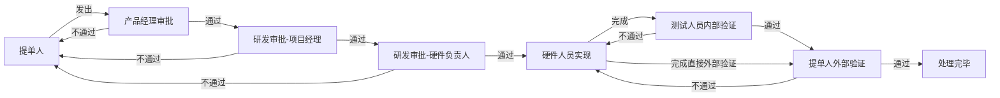
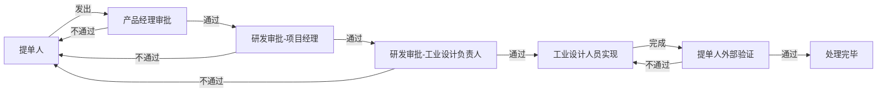
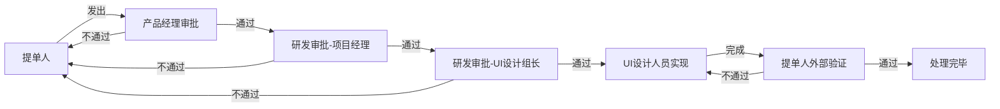

## 软件需求流程

```mermaid
graph LR
提单人--发出-->产品经理审批
产品经理审批--通过-->研发审批-项目经理
研发审批-项目经理--通过-->研发审批-软件负责人
研发审批-软件负责人--通过-->软件人员实现
软件人员实现--完成-->测试人员内部验证
测试人员内部验证--通过-->提单人外部验证
软件人员实现--完成直接外部验证-->提单人外部验证
提单人外部验证--通过-->处理完毕
产品经理审批--不通过-->提单人
研发审批-项目经理--不通过-->提单人
研发审批-软件负责人--不通过-->提单人
测试人员内部验证--不通过-->软件人员实现
提单人外部验证--不通过-->软件人员实现
```

## 硬件需求流程

```mermaid
graph LR
提单人--发出-->产品经理审批
产品经理审批--通过-->研发审批-项目经理
研发审批-项目经理--通过-->研发审批-硬件负责人
研发审批-硬件负责人--通过-->硬件人员实现
硬件人员实现--完成-->测试人员内部验证
测试人员内部验证--通过-->提单人外部验证
硬件人员实现--完成直接外部验证-->提单人外部验证
提单人外部验证--通过-->处理完毕
产品经理审批--不通过-->提单人
研发审批-项目经理--不通过-->提单人
研发审批-硬件负责人--不通过-->提单人
测试人员内部验证--不通过-->硬件人员实现
提单人外部验证--不通过-->硬件人员实现
```

## 工业设计需求流程

```mermaid
graph LR
提单人--发出-->产品经理审批
产品经理审批--通过-->研发审批-项目经理
研发审批-项目经理--通过-->研发审批-工业设计负责人
研发审批-工业设计负责人--通过-->工业设计人员实现
工业设计人员实现--完成-->提单人外部验证
提单人外部验证--通过-->处理完毕
产品经理审批--不通过-->提单人
研发审批-项目经理--不通过-->提单人
研发审批-工业设计负责人--不通过-->提单人
提单人外部验证--不通过-->工业设计人员实现
```

## UI设计需求流程

```mermaid
graph LR
提单人--发出-->产品经理审批
产品经理审批--通过-->研发审批-项目经理
研发审批-项目经理--通过-->研发审批-UI设计组长
研发审批-UI设计组长--通过-->UI设计人员实现
UI设计人员实现--完成-->提单人外部验证
提单人外部验证--通过-->处理完毕
产品经理审批--不通过-->提单人
研发审批-项目经理--不通过-->提单人
研发审批-UI设计组长--不通过-->提单人
提单人外部验证--不通过-->UI设计人员实现
```

